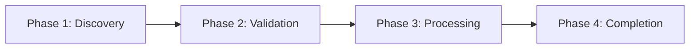
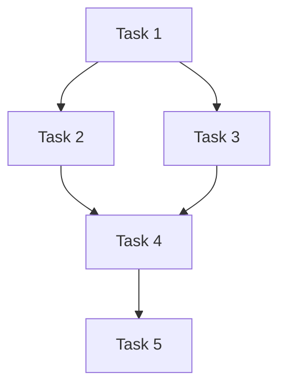
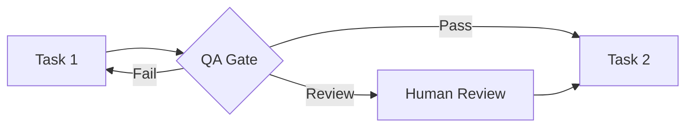

# Validate Compliance & Generate Documentation Task

## Purpose

To validate the complete hybrid process against AIOS-PM standards and generate comprehensive documentation for deployment and operational use.

## Inputs

- All outputs from Phase 1-8:
  - Process definition YAML from Phase 2
  - Executor assignment matrix from Phase 3
  - Workflow definitions from Phase 4
  - Task definitions with data contracts from Phase 5
  - QA gate definitions from Phase 6
  - ClickUp configuration from Phase 7
  - Agent definitions from Phase 8
- Templates from `expansion-packs/hybrid-ops/templates/`
- AIOS-PM compliance standards

## Key Activities & Instructions

### 1. Run Automated Compliance Validation

**1.1 Load Compliance Template**

Use: `templates/compliance-report-tmpl.yaml`
Output to: `output/processes/{process_id}-compliance-report.md`

**1.2 Validate Process Structure**

Check against AIOS-PM standards:

```yaml
compliance_checks:
  process_structure:
    - check: "Process definition YAML exists and valid"
      location: output/processes/{process_id}.yaml
      severity: critical
    - check: "All phases defined with entry/exit criteria"
      expected: 3-7 phases
      severity: critical
    - check: "Task dependencies properly mapped"
      validation: no_circular_dependencies
      severity: critical
```

**1.3 Validate Task Definitions**

```yaml
  task_definitions:
    - check: "Task YAML for every task in process"
      location: tasks/{task_id}.yaml
      severity: critical
    - check: "All input schemas defined with sources"
      validation: no_missing_sources
      severity: critical
    - check: "All output schemas defined with destinations"
      validation: no_broken_handoffs
      severity: critical
    - check: "Quality checklists present"
      severity: major
```

**1.4 Validate Executor Assignments**

```yaml
  executor_assignments:
    - check: "Every task has executor assigned"
      validation: no_unassigned_tasks
      severity: critical
    - check: "Hybrid executors have complete decision logic"
      validation: confidence_thresholds_defined
      severity: critical
    - check: "Fallback executors configured for all agents"
      validation: escalation_paths_complete
      severity: critical
```

**1.5 Validate Data Contracts**

```yaml
  data_contracts:
    - check: "No broken data dependencies"
      validation: all_inputs_have_sources
      severity: critical
    - check: "Data types consistent across handoffs"
      validation: schema_compatibility
      severity: major
    - check: "Required fields properly mapped"
      validation: field_mapping_complete
      severity: major
```

**1.6 Validate QA Gates**

```yaml
  qa_gates:
    - check: "Critical handoffs have QA gates"
      validation: high_risk_points_covered
      severity: major
    - check: "Decision matrix complete (pass/concerns/fail/waived)"
      severity: major
    - check: "Validation criteria measurable"
      validation: no_subjective_checks
      severity: minor
```

**1.7 Validate ClickUp Configuration**

```yaml
  clickup_config:
    - check: "AIOS-PM custom fields configured"
      required_fields:
        - Executor Type
        - Assigned Executor
        - Task Type
        - Automation Ready
        - QA Gate
      severity: critical
    - check: "Automations defined for handoffs"
      validation: automatic_handoff_logic
      severity: major
    - check: "Views created for all stakeholder types"
      stakeholders: [executors, management, qa_team]
      severity: minor
```

**1.8 Validate Agent Definitions**

```yaml
  agent_definitions:
    - check: "Agent file for every planned agent"
      location: agents/{agent_id}.md
      severity: critical
    - check: "Commands defined with parameters"
      validation: command_syntax_valid
      severity: critical
    - check: "Decision logic configured"
      validation: confidence_thresholds_present
      severity: critical
    - check: "Error handling strategies defined"
      severity: major
```

### 2. Generate Compliance Score

**2.1 Calculate Overall Score**

```yaml
scoring:
  overall_score:
    formula: (passed_critical * 0.5) + (passed_major * 0.3) + (passed_minor * 0.2)
    scale: 0-100%

  thresholds:
    excellent: ">= 95%"
    good: "85-94%"
    acceptable: "70-84%"
    needs_improvement: "< 70%"
```

**2.2 Calculate Category Scores**

Score each validation category:
- Process Structure: X/Y checks passed
- Task Definitions: X/Y checks passed
- Executor Assignments: X/Y checks passed
- Data Contracts: X/Y checks passed
- QA Gates: X/Y checks passed
- ClickUp Configuration: X/Y checks passed
- Agent Definitions: X/Y checks passed

**2.3 Identify Critical Issues**

List all failed critical checks:
```markdown
## Critical Issues (Blocking)

1. **Missing Task Definition: validate-customer-data**
   - Severity: Critical
   - Impact: Workflow cannot execute
   - Remediation: Create tasks/validate-customer-data.yaml
   - Priority: Immediate

2. **Broken Data Dependency: task-5 → task-7**
   - Severity: Critical
   - Impact: Data handoff will fail
   - Remediation: Update task-5 output schema to include required fields
   - Priority: Immediate
```

**2.4 Generate Recommendations**

For each issue:
- Root cause analysis
- Recommended fix
- Priority (immediate/high/medium/low)
- Estimated effort
- Assigned owner

### 3. Create Action Plan

**3.1 Prioritize Issues**

Group by severity and impact:
1. **Immediate (Critical Blockers)**
   - Must fix before deployment
   - Prevent process execution

2. **High Priority (Major Issues)**
   - Fix before production rollout
   - Impact quality or reliability

3. **Medium Priority (Minor Issues)**
   - Fix in next iteration
   - Optimize or improve

4. **Low Priority (Enhancements)**
   - Nice-to-have improvements
   - Future consideration

**3.2 Assign Ownership**

For each issue:
```yaml
action_item:
  id: compliance-001
  issue: "Missing QA gate for high-risk handoff"
  severity: major
  assigned_to: qa-architect
  due_date: "+3 days"
  estimated_effort: 2h
  dependencies: []
```

**3.3 Create Tracking Dashboard**

Generate action plan with:
- Issue ID
- Description
- Severity
- Owner
- Status (Not Started/In Progress/Complete)
- Due Date
- Progress Notes

### 4. Generate Process Documentation

**4.1 Create Process README**

Use: `templates/process-readme-tmpl.yaml`
Output to: `output/processes/{process_id}/README.md`

**Include:**
```markdown
# {Process Name}

## Overview
Brief description of the process and its purpose.

## Process Statistics
- **Phases:** X phases
- **Tasks:** Y total tasks
- **Executors:** Z human + W agent + V hybrid
- **Automation Level:** XX%

## Quick Start

### For Human Executors
How to start working on tasks in this process.

### For Process Managers
How to monitor and manage process execution.

### For Agents
How agents are activated and execute tasks.

## Process Structure

### Phase 1: {Phase Name}
- Tasks in this phase
- Entry criteria
- Exit criteria

## Executor Guide

### Human Executors
List of human roles and their tasks.

### Agent Executors
List of agents and their capabilities.

## ClickUp Configuration
Link to ClickUp setup guide.

## Troubleshooting
Common issues and solutions.
```

**4.2 Create Quick Start Guides**

**For Humans:**
```markdown
# Quick Start Guide (Human Executors)

## Your Tasks
View your assigned tasks in ClickUp: [Link]

## How to Execute a Task
1. Open task in ClickUp
2. Follow workflow instructions: workflows/{workflow_id}.md
3. Complete quality checklist
4. Update task status
5. System auto-creates next task

## Getting Help
- Check workflow documentation
- Ask process owner: {owner_name}
- Escalate to: {escalation_path}
```

**For Agents:**
```markdown
# Quick Start Guide (Agent Executors)

## Agent Activation
Agents are activated via ClickUp webhooks or slash commands:
- `@hybridOps:{agent-name}`

## Task Execution
1. Fetch task context from ClickUp
2. Load workflow definition
3. Execute steps with confidence tracking
4. Update task with results
5. Trigger handoff if confidence >= threshold

## Escalation Rules
- Confidence < 0.80: Immediate human takeover
- Confidence 0.80-0.94: Flag for human review
- Confidence >= 0.95: Complete automatically
```

**For Process Managers:**
```markdown
# Quick Start Guide (Process Managers)

## Monitoring Dashboard
Access ClickUp views:
- Process Overview (timeline view)
- Automation Readiness (table view)
- QA Review Queue (list view)

## Key Metrics
- Tasks in progress
- Tasks blocked
- Agent confidence trends
- QA pass/fail rates
- SLA compliance

## Intervention Points
When to intervene:
- Critical QA failures
- Tasks overdue > 4 hours
- Agent escalations
- Compliance issues
```

**4.3 Generate Process Diagrams**

**Phase Flow Diagram (Mermaid):**


**Task Dependency Map:**


**Handoff Flow with QA Gates:**


**4.4 Compile Artifacts Package**

Create complete documentation package:
```
output/processes/{process_id}/
├── README.md
├── quick-start-humans.md
├── quick-start-agents.md
├── quick-start-managers.md
├── diagrams/
│   ├── phase-flow.mmd
│   ├── task-dependencies.mmd
│   └── handoff-flow.mmd
├── compliance-report.md
├── {process_id}.yaml (process definition)
└── artifacts-manifest.yaml
```

**4.5 Create Artifacts Manifest**

```yaml
artifacts:
  process_definition:
    file: "{process_id}.yaml"
    type: yaml
    description: "Complete process definition with phases and tasks"

  task_definitions:
    location: "tasks/"
    count: Y
    description: "Individual task YAML files with data contracts"

  workflows:
    location: "workflows/"
    count: Y
    description: "Step-by-step workflow markdown files"

  qa_gates:
    location: "qa-gates/"
    count: X
    description: "Quality gate definitions with validation criteria"

  clickup_config:
    file: "clickup/{process_id}-clickup-config.yaml"
    description: "Complete ClickUp workspace configuration"

  agent_definitions:
    location: "agents/"
    count: Z
    description: "AIOS agent definition files"

  documentation:
    location: "./"
    files:
      - README.md
      - quick-start-humans.md
      - quick-start-agents.md
      - quick-start-managers.md

  diagrams:
    location: "diagrams/"
    files:
      - phase-flow.mmd
      - task-dependencies.mmd
      - handoff-flow.mmd

version_control:
  version: 1.0.0
  created_date: "{timestamp}"
  created_by: "{user}"
  last_modified: "{timestamp}"
```

### 5. Final Review & Approval

**5.1 Stakeholder Review Checklist**

```yaml
stakeholder_approval:
  - stakeholder: process_owner
    reviews:
      - Process structure makes sense
      - Task breakdown appropriate
      - Resource allocation feasible
    status: pending

  - stakeholder: human_executors
    reviews:
      - Workflows are clear and executable
      - Tools and access documented
      - Time estimates realistic
    status: pending

  - stakeholder: it_team
    reviews:
      - System integrations feasible
      - Security requirements met
      - Technical dependencies clear
    status: pending

  - stakeholder: compliance_team
    reviews:
      - Regulatory requirements met
      - QA gates sufficient
      - Audit trail complete
    status: pending
```

**5.2 Final Sign-Off**

Document approvals:
- Process Owner: [Name] [Date]
- Technical Lead: [Name] [Date]
- Compliance Officer: [Name] [Date]
- Project Sponsor: [Name] [Date]

## Outputs

- **Compliance Report** (`output/processes/{process_id}-compliance-report.md`)
  - Overall compliance score (0-100%)
  - Category-specific scores
  - Critical issues list with remediation steps
  - Prioritized action plan with owners and deadlines

- **Process README** (`output/processes/{process_id}/README.md`)
  - Complete process overview
  - Statistics and metrics
  - Quick reference guide
  - Troubleshooting section

- **Quick Start Guides**
  - For human executors
  - For agent executors
  - For process managers

- **Process Diagrams** (Mermaid format)
  - Phase flow diagram
  - Task dependency map
  - Handoff flow with QA gates

- **Documentation Package**
  - All artifacts compiled
  - Manifest with version control
  - Reference links
  - Deployment readiness checklist

## Next Steps

**Process Complete - Ready for Deployment**

When compliance validation and documentation are complete:

1. **Confirm Compliance Score:**
   - Excellent (≥ 95%): Deploy immediately
   - Good (85-94%): Address critical issues, then deploy
   - Acceptable (70-84%): Complete action plan before deployment
   - Needs Improvement (< 70%): Major rework required

2. **Deployment Readiness Checklist:**
   - [ ] Compliance score ≥ 85%
   - [ ] All critical issues resolved
   - [ ] Stakeholder approvals received
   - [ ] Documentation complete
   - [ ] ClickUp workspace configured
   - [ ] Agents tested and ready
   - [ ] Training materials prepared
   - [ ] Rollout plan approved

3. **Handoff to Operations:**
   - Provide documentation package to operations team
   - Schedule training sessions for human executors
   - Configure ClickUp workspace
   - Deploy and activate agents
   - Monitor initial execution
   - Collect feedback for iteration

**Success Criteria for Process Completion:**
- [ ] Compliance score calculated (≥ 85% required)
- [ ] All critical issues documented with action plan
- [ ] Process README generated
- [ ] Quick start guides created for all stakeholders
- [ ] Process diagrams generated
- [ ] Artifacts manifest complete
- [ ] Stakeholder approvals received
- [ ] Deployment readiness confirmed
