# Hybrid-Ops — Guia do Usuário

Este guia vai te ajudar a entender e usar efetivamente o método Hybrid-Ops para criar e implementar processos híbridos humano-agente.

## O Workflow de Criação de Processos Híbridos

O Hybrid-Ops segue um workflow estruturado de 9 fases para transformar processos manuais em processos híbridos executáveis por humanos E agentes de IA. Cada fase é coordenada por um agente META especializado que recebe o output da fase anterior e passa o resultado para a próxima.

### O Workflow Completo (9 Fases)

```mermaid
graph TD
    A["Início: Ideia de Processo"] --> B["FASE 1: process-mapper"]
    B --> C["process-mapper: *start-discovery"]
    C --> D["process-mapper: *capture-current-state"]
    D --> E["process-mapper: *identify-pain-points"]
    E --> F["process-mapper: *assess-automation"]
    F --> G["process-mapper: *generate-discovery-doc"]

    G --> H["FASE 2: process-architect"]
    H --> I["process-architect: *design-process"]
    I --> J["process-architect: *define-phases"]
    J --> K["process-architect: *identify-tasks"]
    K --> L["process-architect: *map-dependencies"]
    L --> M["process-architect: *generate-process-yaml"]

    M --> N["FASE 3: executor-designer"]
    N --> O["executor-designer: *design-executors"]
    O --> P["executor-designer: *create-assignment-matrix"]
    P --> Q["executor-designer: *analyze-workload"]
    Q --> R{"Híbridos?"}
    R -->|Sim| S["executor-designer: *design-hybrid-execution"]
    R -->|Não| T["FASE 4: workflow-designer"]
    S --> T

    T --> U["workflow-designer: *design-workflows"]
    U --> V["workflow-designer: *create-workflow"]
    V --> W["workflow-designer: *validate-universality"]

    W --> X["FASE 5: workflow-designer"]
    X --> Y["workflow-designer: *define-data-contracts"]
    Y --> Z["workflow-designer: *create-task-definitions"]
    Z --> AA["workflow-designer: *design-handoff-mappings"]

    AA --> AB["FASE 6: qa-architect"]
    AB --> AC["qa-architect: *identify-gate-candidates"]
    AC --> AD["qa-architect: *define-validation-criteria"]
    AD --> AE["qa-architect: *create-decision-matrix"]
    AE --> AF["qa-architect: *design-escalation-rules"]

    AF --> AG["FASE 7: clickup-engineer"]
    AG --> AH["clickup-engineer: *map-phases-to-lists"]
    AH --> AI["clickup-engineer: *configure-custom-fields"]
    AI --> AJ["clickup-engineer: *design-automations"]
    AJ --> AK["clickup-engineer: *generate-implementation-guide"]

    AK --> AL["FASE 8: agent-generator"]
    AL --> AM["agent-generator: *generate-agents"]
    AM --> AN["agent-generator: *create-agent"]
    AN --> AO["agent-generator: *design-agent-integration"]

    AO --> AP["FASE 9: compliance-validator"]
    AP --> AQ["compliance-validator: *validate-process"]
    AQ --> AR["compliance-validator: *calculate-compliance-score"]
    AR --> AS{"Score >= 90%?"}
    AS -->|Não| AT["compliance-validator: *create-action-plan"]
    AT --> AQ
    AS -->|Sim| AU["doc-generator: *generate-documentation"]
    AU --> AV["doc-generator: *compile-artifacts"]
    AV --> AW["✅ Processo Pronto"]

    style A fill:#f5f5f5,color:#000
    style B fill:#e8f5e9,color:#000
    style C fill:#e8f5e9,color:#000
    style D fill:#e8f5e9,color:#000
    style E fill:#e8f5e9,color:#000
    style F fill:#e8f5e9,color:#000
    style G fill:#e8f5e9,color:#000
    style H fill:#f3e5f5,color:#000
    style I fill:#f3e5f5,color:#000
    style J fill:#f3e5f5,color:#000
    style K fill:#f3e5f5,color:#000
    style L fill:#f3e5f5,color:#000
    style M fill:#f3e5f5,color:#000
    style N fill:#e1f5fe,color:#000
    style O fill:#e1f5fe,color:#000
    style P fill:#e1f5fe,color:#000
    style Q fill:#e1f5fe,color:#000
    style R fill:#e3f2fd,color:#000
    style S fill:#ffd54f,color:#000
    style T fill:#ede7f6,color:#000
    style U fill:#ede7f6,color:#000
    style V fill:#ede7f6,color:#000
    style W fill:#ede7f6,color:#000
    style X fill:#ede7f6,color:#000
    style Y fill:#ede7f6,color:#000
    style Z fill:#ede7f6,color:#000
    style AA fill:#ede7f6,color:#000
    style AB fill:#ffd54f,color:#000
    style AC fill:#ffd54f,color:#000
    style AD fill:#ffd54f,color:#000
    style AE fill:#ffd54f,color:#000
    style AF fill:#ffd54f,color:#000
    style AG fill:#e0f2f1,color:#000
    style AH fill:#e0f2f1,color:#000
    style AI fill:#e0f2f1,color:#000
    style AJ fill:#e0f2f1,color:#000
    style AK fill:#e0f2f1,color:#000
    style AL fill:#f1f8e9,color:#000
    style AM fill:#f1f8e9,color:#000
    style AN fill:#f1f8e9,color:#000
    style AO fill:#f1f8e9,color:#000
    style AP fill:#fff9c4,color:#000
    style AQ fill:#fff9c4,color:#000
    style AR fill:#fff9c4,color:#000
    style AS fill:#e3f2fd,color:#000
    style AT fill:#ffcdd2,color:#000
    style AU fill:#fff9c4,color:#000
    style AV fill:#fff9c4,color:#000
    style AW fill:#34a853,color:#fff
```



### Fluxo Simplificado por Fase

```mermaid
graph LR
    A[1. Discovery] --> B[2. Arquitetura]
    B --> C[3. Executores]
    C --> D[4. Workflows]
    D --> E[5. Tasks]
    E --> F[6. QA Gates]
    F --> G[7. ClickUp]
    G --> H[8. Agentes]
    H --> I[9. Compliance]

    style A fill:#e8f5e9,color:#000
    style B fill:#f3e5f5,color:#000
    style C fill:#e1f5fe,color:#000
    style D fill:#ede7f6,color:#000
    style E fill:#ede7f6,color:#000
    style F fill:#ffd54f,color:#000
    style G fill:#e0f2f1,color:#000
    style H fill:#f1f8e9,color:#000
    style I fill:#fff9c4,color:#000
```



## Pré-requisitos

Antes de usar o Hybrid-Ops, certifique-se de ter:

- **AIOS-FULLSTACK v4+** instalado e configurado
- **Node.js** ≥ 18, **npm** ≥ 9
- **Conta ClickUp** (para implementação operacional)
- **(Opcional)** VS Code com extensões "Markdown All in One" + "Markdown Preview Mermaid Support"

## Instalação

```bash
# Instalação do expansion pack
npm run install:expansion hybrid-ops

# Ou manualmente
node tools/install-expansion-pack.js hybrid-ops
```

## Os 9 Agentes META

### 1. Process Mapper (Fase 1: Discovery & Mapeamento)

**Quando usar**: Início de todo processo novo ou migração de processo existente

**Ativação**:
```bash
@hybridOps:process-mapper
```

**Comandos principais**:
```bash
*start-discovery              # Inicia mapeamento completo de processo
*map-current-state           # Mapeia processo existente (brownfield)
*assess-automation-opportunities  # Identifica tasks automatizáveis
*help                        # Lista todos os comandos disponíveis
```

**O que faz**:
- Captura estado atual do processo via elicitação interativa
- Identifica pain points e gargalos
- Avalia potencial de automação de cada task
- Classifica tasks por complexidade e risco
- Gera documento de discovery estruturado

**Output**:
```
output/processes/{process_id}/discovery.md
```

**Conteúdo do discovery**:
- Nome e objetivo do processo
- Stakeholders e responsáveis
- Tasks atuais (se brownfield)
- Pain points identificados
- Oportunidades de automação (HIGH/MEDIUM/LOW)
- Métricas atuais vs desejadas
- Restrições e considerações

**Exemplo de interação**:
```
Usuário: Quero mapear nosso processo de onboarding de cliente

Agent: Vou iniciar o discovery. Primeiro, me conte sobre o processo atual.

*start-discovery

[Elicitação interativa]
- Qual o nome do processo?
- Quem são os stakeholders?
- Quais as principais etapas hoje?
- Onde estão os gargalos?
- O que você gostaria de automatizar?

Output: discovery.md gerado com:
- 15 tasks identificadas
- 8 tasks com potencial de automação HIGH
- 3 pain points críticos documentados
- Handoff para Phase 2: Arquitetura
```

---

### 2. Process Architect (Fase 2: Arquitetura de Processo)

**Quando usar**: Após discovery completo, para estruturar o processo

**Ativação**:
```bash
@hybridOps:process-architect
```

**Comandos principais**:
```bash
*start-architecture          # Inicia design de arquitetura
*define-phases              # Define fases do processo
*identify-tasks             # Identifica todas as tasks
*map-dependencies           # Mapeia dependências entre tasks
*help
```

**O que faz**:
- Agrupa tasks relacionadas em fases lógicas (3-7 fases)
- Define critérios de entrada/saída para cada fase
- Mapeia dependências entre tasks
- Cria sequenciamento lógico
- Identifica paralelizações possíveis
- Gera YAML de definição de processo

**Output**:
```
output/processes/{process_id}/process-definition.yaml
```

**Estrutura do process-definition.yaml**:
```yaml
process:
  id: customer-onboarding
  name: Customer Onboarding
  type: operational
  owner: Sarah Thompson

phases:
  - id: data-collection
    name: Data Collection
    entry_criteria: "New customer signup completed"
    exit_criteria: "All required data validated"
    tasks: [collect-info, validate-data]

  - id: system-config
    name: System Configuration
    entry_criteria: "Data validation passed"
    exit_criteria: "System ready for customer"
    tasks: [create-account, setup-access]

dependencies:
  - from: validate-data
    to: create-account
    type: blocking
```

**Exemplo de interação**:
```
Agent: Com base no discovery, vou estruturar seu processo.

*define-phases

Identifiquei 5 fases naturais:
1. Data Collection (3 tasks)
2. Validation (2 tasks)
3. System Configuration (4 tasks)
4. Welcome & Onboarding (3 tasks)
5. Handoff to Support (2 tasks)

*map-dependencies

Mapeei 8 dependências críticas:
- validate-data DEVE completar antes de create-account
- setup-access PODE correr em paralelo com send-welcome-email

Output: process-definition.yaml com 14 tasks organizadas em 5 fases
```

---

### 3. Executor Designer (Fase 3: Design de Executores)

**Quando usar**: Após arquitetura definida, para atribuir executores

**Ativação**:
```bash
@hybridOps:executor-designer
```

**Comandos principais**:
```bash
*start-executor-design       # Inicia design de executores
*assign-tasks               # Atribui tasks a executores
*balance-workload           # Balanceia carga entre executores
*create-hybrid-executors    # Cria executores híbridos
*help
```

**O que faz**:
- Analisa cada task e recomenda tipo de executor (humano/agente/híbrido)
- Cria definições de executores com skills necessárias
- Atribui tasks considerando capacidade e expertise
- Balanceia workload entre executores
- Define lógica de escalação para executores híbridos
- Gera matriz RACI e relatório de alocação

**Tipos de Executor**:

1. **Humano**: Tasks complexas, julgamento crítico, relações interpessoais
2. **Agente**: Tasks repetitivas, validações, processamento de dados
3. **Híbrido**: Agente primário + humano fallback (com escalação automática)

**Output**:
```
output/processes/{process_id}/executors/
├── executor-sarah-thompson.md    # Humano
├── executor-validation-agent.md  # Agente
└── executor-data-processor.md    # Híbrido
```

**Estrutura de executor híbrido**:
```yaml
executor:
  id: data-processor
  type: hybrid
  primary: agent
  fallback: human

escalation_logic:
  confidence_threshold: 0.85
  triggers:
    - data_quality_score < 0.9
    - ambiguous_field_detected
    - manual_review_requested

human_fallback:
  person: Sarah Thompson
  notification: slack
  sla: 2 hours
```

**Exemplo de interação**:
```
Agent: Vou analisar as 14 tasks e recomendar executores.

*assign-tasks

Recomendações:
✅ AGENTE: validate-customer-data (repetitivo, regras claras)
✅ HUMANO: complex-data-review (requer julgamento)
✅ HÍBRIDO: send-welcome-email (agente primário, humano revisa edge cases)

*balance-workload

Alocação atual:
- Sarah: 60% capacidade (6 tasks)
- Mike: 75% capacidade (5 tasks)
- validation-agent: Ilimitado (3 tasks)

⚠️ Mike está perto do limite. Recomendo reatribuir 1 task.

Output: 3 executor files + assignment-matrix.yaml + RACI-matrix.md
```

---

### 4 & 5. Workflow Designer (Fases 4 & 5: Workflows + Task Definitions)

**Quando usar**: Após executores atribuídos, para criar workflows e definir tasks

**Ativação**:
```bash
@hybridOps:workflow-designer
```

**Comandos principais**:
```bash
*start-workflow-design       # Cria workflows universais (Fase 4)
*start-task-definitions      # Cria definições completas (Fase 5)
*design-data-contracts       # Define schemas de input/output
*map-handoffs               # Mapeia handoffs entre tasks
*help
```

**O que faz (Fase 4 - Workflows)**:
- Cria instruções passo-a-passo executáveis por humanos E agentes
- Usa linguagem universal (sem termos humano-específicos ou código)
- Define ferramentas/sistemas necessários
- Documenta pré-requisitos e pós-condições
- Gera 1 arquivo de workflow por task

**O que faz (Fase 5 - Task Definitions)**:
- Define data contracts (JSON Schema) para inputs/outputs
- Mapeia handoffs entre tasks
- Cria regras de transformação de dados
- Define checklists de qualidade
- Gera YAML completo de definições

**Output**:
```
output/processes/{process_id}/
├── workflows/
│   ├── validate-customer-data.md
│   ├── create-account.md
│   └── send-welcome-email.md
└── tasks/
    └── task-definitions.yaml
```

**Estrutura de workflow universal**:
```markdown
# Validate Customer Data

## Executor
validation-agent (Hybrid: Agent Primary, Human Fallback)

## Ferramentas Necessárias
- CRM System (read/write access)
- Validation Rule Engine
- Slack (for escalation)

## Pré-requisitos
- Customer form submitted
- Form data available in CRM

## Instruções Passo-a-Passo

### 1. Retrieve Customer Data
Acesse o CRM e carregue o registro do cliente pelo ID.

**Verificação**: Confirme que todos os campos obrigatórios estão preenchidos.

### 2. Validate Email Format
Execute regex validation: `^[a-zA-Z0-9._%+-]+@[a-zA-Z0-9.-]+\.[a-zA-Z]{2,}$`

**Se inválido**: Marque campo para revisão humana.

### 3. Check for Duplicates
Query CRM: busque email existente.

**Se duplicado**: Escale para humano com contexto.

### 4. Calculate Data Quality Score
Some pontos:
- Email válido: +30
- Phone válido: +20
- Address completo: +25
- Company info: +25

**Score mínimo**: 75

### 5. Make Decision
- Score >= 85 E sem duplicados: APPROVE
- Score 75-84: APPROVE_WITH_CONCERNS
- Score < 75 OU duplicado: ESCALATE_TO_HUMAN

## Outputs
- validation_status: APPROVED | CONCERNS | ESCALATED
- data_quality_score: 0-100
- validation_timestamp: ISO8601
- escalation_reason: string (if escalated)

## Handoff
**Próxima task**: create-account
**Condição**: validation_status = APPROVED ou APPROVED_WITH_CONCERNS
```

**Estrutura de data contract**:
```yaml
tasks:
  - id: validate-customer-data
    input_schema:
      type: object
      required: [customer_id, form_data]
      properties:
        customer_id:
          type: string
          format: uuid
        form_data:
          type: object
          required: [email, name]
          properties:
            email: {type: string, format: email}
            name: {type: string, minLength: 2}
            phone: {type: string, pattern: "^\\+?[1-9]\\d{1,14}$"}

    output_schema:
      type: object
      required: [validation_status, data_quality_score]
      properties:
        validation_status:
          type: string
          enum: [APPROVED, CONCERNS, ESCALATED]
        data_quality_score:
          type: number
          minimum: 0
          maximum: 100
        escalation_reason:
          type: string

    handoff_to: create-account
    handoff_mapping:
      customer_id: customer_id  # pass-through
      validation_status: prerequisite_check
```

**Exemplo de interação**:
```
Agent: Vou criar workflows universais para suas 14 tasks.

*start-workflow-design

Criando workflow: validate-customer-data
✅ Identificadas 5 steps
✅ Verificações em cada step
✅ Linguagem executável por humano E agente
✅ Condições de escalação definidas

[...cria workflows para todas as tasks...]

*start-task-definitions

Definindo data contracts:
✅ validate-customer-data: 3 inputs, 4 outputs
✅ create-account: 5 inputs, 2 outputs
✅ send-welcome-email: 4 inputs, 1 output

*map-handoffs

Mapeados 13 handoffs:
✅ validate-customer-data → create-account (com transformação)
✅ create-account → setup-access (pass-through de IDs)
✅ send-welcome-email → handoff-to-support (com agregação)

Output: 14 workflow files + task-definitions.yaml completo
```

---

### 6. QA Architect (Fase 6: Design de QA Gates)

**Quando usar**: Após workflows/tasks definidos, para adicionar quality gates

**Ativação**:
```bash
@hybridOps:qa-architect
```

**Comandos principais**:
```bash
*start-qa-design             # Inicia design de QA gates
*create-validation-criteria  # Cria critérios de validação
*configure-decision-logic    # Configura matriz de decisão
*help
```

**O que faz**:
- Identifica handoffs críticos que precisam de gates
- Define critérios de validação mensuráveis
- Cria matriz de decisão (PASS/CONCERNS/FAIL/WAIVED)
- Configura severidades (CRITICAL/MAJOR/MINOR)
- Define regras de escalação
- Atribui validadores

**Tipos de QA Gate**:

1. **Blocking Gate**: Impede progressão se falhar
2. **Warning Gate**: Permite progressão mas sinaliza preocupações
3. **Informational Gate**: Apenas registra para auditoria

**Output**:
```
output/processes/{process_id}/qa-gates/gate-definitions.yaml
```

**Estrutura de QA gate**:
```yaml
gates:
  - id: data-validation-gate
    name: Customer Data Validation Gate
    type: blocking
    trigger: after_task_validate-customer-data

    validation_criteria:
      - id: data-quality
        description: Data quality score must be >= 75
        type: automated
        severity: critical
        pass_condition: "data_quality_score >= 75"

      - id: no-duplicates
        description: Customer email must be unique
        type: automated
        severity: critical
        pass_condition: "duplicate_found == false"

      - id: manual-review-complete
        description: Manual review completed if escalated
        type: manual
        severity: major
        pass_condition: "escalation_resolved == true"

    decision_matrix:
      PASS:
        criteria:
          - all_critical_passed: true
          - all_major_passed: true

      CONCERNS:
        criteria:
          - all_critical_passed: true
          - some_major_failed: true
        action: notify_pm

      FAIL:
        criteria:
          - any_critical_failed: true
        action: block_and_escalate

      WAIVED:
        requires:
          - reason: string
          - approver: string
          - expiry_date: date

    escalation:
      on_fail:
        notify: [pm, qa-lead]
        sla: 4 hours
      on_concerns:
        notify: [task-owner]
        sla: 24 hours
```

**Exemplo de interação**:
```
Agent: Vou analisar seus handoffs e identificar onde precisamos de gates.

*create-validation-criteria

Handoffs críticos identificados:
1️⃣ validate-customer-data → create-account (dados ruins = retrabalho)
2️⃣ setup-access → send-welcome-email (acesso correto essencial)

Recomendo 2 BLOCKING gates.

*configure-decision-logic

Gate 1: data-validation-gate
- 2 critérios CRITICAL (automated)
- 1 critério MAJOR (manual)
- Bloqueio se qualquer CRITICAL falhar

Gate 2: access-verification-gate
- 3 critérios CRITICAL
- Permite WAIVED com aprovação do PM

Output: gate-definitions.yaml com 2 gates configurados
```

---

### 7. ClickUp Engineer (Fase 7: Implementação ClickUp)

**Quando usar**: Após QA gates definidos, para configurar operacionalização

**Ativação**:
```bash
@hybridOps:clickup-engineer
```

**Comandos principais**:
```bash
*start-clickup-config        # Inicia configuração ClickUp
*create-custom-fields       # Define 20 custom fields AIOS-PM
*configure-automations      # Cria automações de handoff
*setup-views                # Configura views por stakeholder
*help
```

**O que faz**:
- Projeta estrutura de Space/Folder/Lists (mapeia fases para lists)
- Configura 20 custom fields padrão AIOS-PM
- Cria automações para handoffs automáticos
- Configura triggers de QA gates
- Cria views para diferentes stakeholders
- Gera templates de task

**20 Custom Fields AIOS-PM**:

```yaml
custom_fields:
  # Identificação
  - name: Task ID
    type: text
    required: true

  - name: Process ID
    type: text
    required: true

  - name: Phase
    type: dropdown
    options: [Data Collection, Validation, Config, Welcome, Handoff]

  # Executores
  - name: Executor Type
    type: dropdown
    options: [Human, Agent, Hybrid]

  - name: Primary Executor
    type: user

  - name: Fallback Executor
    type: user
    conditional: "Executor Type = Hybrid"

  # Workflow
  - name: Workflow File
    type: url

  - name: Data Contract
    type: url

  # Qualidade
  - name: Quality Score
    type: number
    range: [0, 100]

  - name: QA Gate Status
    type: dropdown
    options: [PASS, CONCERNS, FAIL, WAIVED, N/A]

  - name: QA Gate File
    type: url

  # Handoffs
  - name: Depends On
    type: relationship
    relationship_type: blocking

  - name: Handoff To
    type: relationship

  - name: Handoff Data
    type: text

  # Métricas
  - name: Estimated Duration
    type: time_estimate

  - name: Actual Duration
    type: time_tracked

  - name: Complexity
    type: dropdown
    options: [Low, Medium, High, Very High]

  # Escalação
  - name: Escalation Trigger
    type: dropdown
    options: [None, Manual Review, Data Quality, Timeout, Error]

  - name: Escalation Reason
    type: text

  # Conformidade
  - name: Compliance Score
    type: number
    range: [0, 100]
```

**Automações Criadas**:

```yaml
automations:
  # Handoff Automation
  - name: Auto-start dependent tasks
    trigger:
      when: status_changed
      from: any
      to: Complete
    condition: "QA Gate Status = PASS OR QA Gate Status = N/A"
    action:
      move_related_tasks:
        relationship: Handoff To
        to_status: Ready to Start
        notification: true

  # QA Gate Trigger
  - name: Request QA validation
    trigger:
      when: status_changed
      to: Ready for Review
    condition: "QA Gate File IS_NOT_EMPTY"
    action:
      - assign_to: qa-validator
      - add_comment: "QA gate validation required"
      - set_priority: high

  # Escalation Alert
  - name: Escalate to human
    trigger:
      when: custom_field_changed
      field: Escalation Trigger
      from: None
      to: any_value
    action:
      - assign_to: Fallback Executor
      - set_priority: urgent
      - notify_slack: "#escalations"

  # Compliance Check
  - name: Warn low compliance
    trigger:
      when: custom_field_changed
      field: Compliance Score
    condition: "Compliance Score < 90"
    action:
      - add_tag: "compliance-review"
      - notify_user: Process Owner
```

**Output**:
```
output/processes/{process_id}/clickup/clickup-setup-guide.md
```

**Exemplo de interação**:
```
Agent: Vou configurar seu processo no ClickUp.

*create-custom-fields

Configurando 20 AIOS-PM custom fields:
✅ Task ID, Process ID, Phase (identificação)
✅ Executor Type, Primary/Fallback (atribuição)
✅ Quality Score, QA Gate Status (qualidade)
✅ Depends On, Handoff To (workflow)
✅ Escalation Trigger/Reason (gestão)

*configure-automations

Criando 8 automações:
1. Auto-start após task completa + gate PASS
2. Trigger QA validation quando Ready for Review
3. Escalate para fallback quando triggered
4. Alerta de compliance < 90%
5. Notificar PM quando CONCERNS
6. Auto-tag por complexity
7. SLA alert após tempo estimado
8. Métricas dashboard update

*setup-views

Criando 5 views:
- By Phase (Kanban por fase)
- By Executor (List por executor)
- QA Status (filtro por gate status)
- Escalations (only escalated tasks)
- Compliance Dashboard (scores e metrics)

Output: clickup-setup-guide.md com instruções completas
```

---

### 8. Agent Generator (Fase 8: Geração de Agentes)

**Quando usar**: Após ClickUp configurado, para gerar agentes identificados na Fase 3

**Ativação**:
```bash
@hybridOps:agent-generator
```

**Comandos principais**:
```bash
*start-agent-generation      # Gera todos os agentes
*create-agent               # Cria agente individual
*define-agent-persona       # Define persona do agente
*design-agent-commands      # Cria comandos do agente
*help
```

**O que faz**:
- Carrega lista de executores tipo "Agent" ou "Hybrid" da Fase 3
- Para cada agente identificado, cria definição AIOS completa
- Define persona com role, expertise, style, focus
- Cria comandos específicos para tasks que o agente executa
- Mapeia templates e knowledge base necessários
- Gera arquivo markdown no formato AIOS padrão

**Estrutura de agente gerado**:
```markdown
# Validation Agent

**Version**: 1.0.0
**Role**: Customer Data Validation Specialist
**Process**: customer-onboarding

---

## Persona

### Role
Automated data validation specialist for customer onboarding process

### Expertise
- Email format validation (regex)
- Phone number validation (E.164)
- Address validation (via API)
- Duplicate detection (database queries)
- Data quality scoring (rule-based)
- Escalation decision logic

### Style
- **Systematic**: Follows validation rules exactly
- **Transparent**: Logs all validation steps
- **Escalation-Ready**: Knows when to ask for help
- **Metrics-Driven**: Tracks quality scores

### Focus
- **Zero false positives** in duplicate detection
- **High confidence thresholds** (>= 85%)
- **Fast turnaround** (< 30 seconds per validation)
- **Clear escalation reasons** for human review

---

## Commands

### Primary Commands

#### `*validate`
Executes complete customer data validation workflow.

**Workflow**: workflows/validate-customer-data.md

**Inputs**:
- customer_id (string, uuid)
- form_data (object)

**Outputs**:
- validation_status (APPROVED|CONCERNS|ESCALATED)
- data_quality_score (0-100)
- escalation_reason (if applicable)

#### `*check-duplicates`
Checks for duplicate customer records by email.

**Steps**:
1. Query CRM by email
2. Compare existing records
3. Return match confidence (0-100)

### Supporting Commands

#### `*help`
Display available commands and usage.

---

## Tasks

### Primary Task
- **validate-customer-data** (Phase 1: Data Collection)

### Workflow Reference
- `workflows/validate-customer-data.md`

---

## Templates

### Uses Templates
- None (uses validation rules from data contract)

---

## Integration Points

### Inputs
- Customer form data (from CRM)
- Validation rules (from data contract)

### Outputs
- Validation result
- Quality score
- Escalation trigger (if needed)

### Handoff To
- **create-account** (if APPROVED or CONCERNS)
- **human-reviewer** (if ESCALATED)

---

## Activation

```
@customerOnboarding:validation-agent
```

---

_Agent Version: 1.0.0_
_Part of: customer-onboarding process_
_Role: Phase 1 - Data Validation_
```

**Output**:
```
output/processes/{process_id}/agents/
├── validation-agent.md
├── email-sender-agent.md
└── data-processor-agent.md
```

**Exemplo de interação**:
```
Agent: Encontrei 3 agentes para gerar (da Fase 3):

1. validation-agent (Hybrid)
2. email-sender-agent (Agent)
3. data-processor-agent (Hybrid)

*start-agent-generation

Gerando validation-agent:
✅ Persona definida (Data Validation Specialist)
✅ 3 comandos criados (*validate, *check-duplicates, *help)
✅ Workflow vinculado (validate-customer-data.md)
✅ Data contracts mapeados
✅ Escalation logic incluída

Gerando email-sender-agent:
✅ Persona definida (Automated Email Sender)
✅ 2 comandos criados (*send-welcome, *help)
✅ Templates vinculados (welcome-email-tmpl)

Gerando data-processor-agent:
✅ Persona definida (Hybrid Data Processor)
✅ 4 comandos criados (*process, *transform, *validate-output, *help)
✅ Confidence thresholds configurados

Output: 3 agent definition files prontos para AIOS
```

---

### 9. Compliance Validator & Doc Generator (Fase 9: Compliance & Documentação)

**Quando usar**: Final do processo, para validar e documentar

**Ativação**:
```bash
@hybridOps:compliance-validator
@hybridOps:doc-generator
```

**Comandos principais**:
```bash
# Compliance Validator
*start-validation            # Validação completa de compliance
*validate-process-structure  # Valida estrutura
*validate-task-definitions   # Valida tasks
*validate-executors         # Valida executores
*validate-data-contracts    # Valida schemas
*validate-qa-gates          # Valida gates
*validate-clickup-config    # Valida ClickUp
*calculate-compliance-score # Calcula pontuação
*create-action-plan         # Cria plano de ação

# Doc Generator
*generate-documentation     # Gera suite completa
*create-quick-start-guides  # Guias de início rápido
*generate-diagrams         # Diagramas do processo
*create-troubleshooting-guide  # Guia de troubleshooting
```

#### Compliance Validator

**O que faz**:
- Valida processo contra metodologia AIOS-PM
- Executa 8 categorias de validação
- Calcula score de 0-100 pontos
- Identifica issues (CRITICAL/MAJOR/MINOR)
- Cria plano de ação priorizado
- Recomenda aprovação ou correções

**Sistema de Pontuação (100 pontos)**:
```yaml
scoring:
  process_structure: 20 pts
  task_definitions: 15 pts (CRITICAL)
  executors: 15 pts (CRITICAL)
  data_contracts: 15 pts (CRITICAL)
  handoffs: 10 pts
  qa_gates: 10 pts
  clickup_config: 10 pts
  documentation: 5 pts

thresholds:
  excellent: ">= 90%" # Pronto para produção
  good: "75-89%"      # Pequenas melhorias
  acceptable: "60-74%" # Grandes melhorias
  poor: "< 60%"       # Não pronto
```

**Output**:
```
output/processes/{process_id}/compliance-report.md
```

**Exemplo de interação**:
```
Agent: Iniciando validação de compliance AIOS-PM.

*validate-process-structure

## Categoria 1: Process Structure (18/20) ✅

Metadata (10/10):
✅ Process ID válido
✅ Owner atribuído
✅ Type especificado

Phases (8/10):
✅ 5 fases definidas
✅ Critérios de entrada/saída
⚠️ Phase gate recomendado após Fase 1

*validate-task-definitions

## Categoria 2: Task Definitions (14/15) ⚠️

14 de 14 tasks validadas:
✅ IDs únicos
✅ Workflows vinculados
✅ Executores atribuídos
❌ 1 task sem output schema (send-welcome-email)

*validate-data-contracts

## Categoria 3: Data Contracts (13/15) ⚠️

Schemas (8/10):
✅ 13/14 tasks com input schema
❌ 1 task sem output schema

Handoffs (5/5):
✅ Todos os 13 handoffs mapeados

[... continua com todas categorias ...]

*calculate-compliance-score

## Compliance Score: 94/100 (94%) ✅ EXCELLENT

Grade: A (Pronto para Produção)

Issues:
- CRITICAL: 0 🎉
- MAJOR: 1 (output schema missing)
- MINOR: 2 (phase gate, quality checklist)

*create-action-plan

## Action Plan

### MAJOR (must fix before go-live)
1. Add output schema to send-welcome-email
   Owner: workflow-designer
   Effort: 15 min
   Due: Before deployment

### MINOR (nice to fix)
1. Add phase gate after Fase 1
   Owner: qa-architect
   Effort: 1 hour
   Due: Sprint 2

## Recomendação: ✅ APPROVED para produção após corrigir 1 issue MAJOR
```

#### Doc Generator

**O que faz**:
- Compila todos os artefatos gerados
- Cria README principal do processo
- Gera 3 quick start guides (Human/Agent/Manager)
- Cria guia de troubleshooting
- Gera diagramas (mermaid)
- Organiza documentação final

**Quick Start Guides**:

1. **QUICKSTART-HUMAN.md**: Para executores humanos
   - Como acessar suas tasks no ClickUp
   - Como executar workflows
   - Quando escalar
   - FAQ comum

2. **QUICKSTART-AGENT.md**: Para agentes AIOS
   - Como ativar agente
   - Comandos disponíveis
   - Data contracts
   - Error handling

3. **QUICKSTART-MANAGER.md**: Para gestores/PMs
   - Como monitorar processo
   - Métricas chave
   - Views do ClickUp
   - Quando intervir

**Output**:
```
output/processes/{process_id}/docs/
├── README.md                    # Overview completo
├── QUICKSTART-HUMAN.md
├── QUICKSTART-AGENT.md
├── QUICKSTART-MANAGER.md
├── TROUBLESHOOTING.md
└── diagrams/
    ├── process-flow.mermaid
    ├── phase-structure.mermaid
    └── handoff-chain.mermaid
```

**Exemplo de interação**:
```
Agent: Compliance validado! Gerando documentação completa.

*generate-documentation

Compilando artefatos:
✅ 1 discovery document
✅ 1 process definition
✅ 4 executors
✅ 14 workflows
✅ 1 task definitions YAML
✅ 2 QA gates
✅ 1 ClickUp guide
✅ 3 agents
✅ 1 compliance report

*create-quick-start-guides

Gerando 3 guias:

1. QUICKSTART-HUMAN.md
   - 4 executores humanos identificados
   - 10 tasks humanas documentadas
   - Instruções passo-a-passo
   - FAQ: 8 perguntas comuns

2. QUICKSTART-AGENT.md
   - 3 agentes documentados
   - Comandos de ativação
   - Data contracts incluídos
   - Error handling patterns

3. QUICKSTART-MANAGER.md
   - 5 métricas chave configuradas
   - 5 views do ClickUp explicadas
   - Quando intervir: 6 situações

*generate-diagrams

Criando diagramas:
✅ process-flow.mermaid (5 fases, 14 tasks)
✅ phase-structure.mermaid (estrutura hierárquica)
✅ handoff-chain.mermaid (13 handoffs mapeados)

*create-troubleshooting-guide

TROUBLESHOOTING.md criado com:
- 12 issues comuns identificados
- Soluções step-by-step
- Quando escalar
- Contatos de suporte

## ✅ Documentação Completa Gerada!

Output: docs/ com 6 arquivos + 3 diagramas
Processo customer-onboarding está PRODUCTION-READY!
```

---

## Artifacts Gerados (Estrutura Completa)

Ao final das 9 fases, você terá:

```
output/processes/customer-onboarding/
├── discovery.md                             # Fase 1
├── process-definition.yaml                  # Fase 2
├── executors/                              # Fase 3
│   ├── sarah-thompson.md
│   ├── mike-johnson.md
│   ├── validation-agent.md
│   └── email-sender-agent.md
├── workflows/                              # Fase 4
│   ├── collect-customer-info.md
│   ├── validate-customer-data.md
│   ├── create-account.md
│   ├── setup-access.md
│   ├── send-welcome-email.md
│   └── [...10 more workflows...]
├── tasks/                                  # Fase 5
│   ├── task-definitions.yaml
│   ├── assignment-matrix.yaml
│   └── RACI-matrix.md
├── qa-gates/                              # Fase 6
│   ├── gate-definitions.yaml
│   ├── data-validation-gate.yaml
│   └── access-verification-gate.yaml
├── clickup/                               # Fase 7
│   ├── clickup-setup-guide.md
│   ├── custom-fields-config.yaml
│   ├── automations-config.yaml
│   └── views-config.yaml
├── agents/                                # Fase 8
│   ├── validation-agent.md
│   ├── email-sender-agent.md
│   └── data-processor-agent.md
├── compliance-report.md                    # Fase 9
└── docs/                                  # Fase 9
    ├── README.md
    ├── QUICKSTART-HUMAN.md
    ├── QUICKSTART-AGENT.md
    ├── QUICKSTART-MANAGER.md
    ├── TROUBLESHOOTING.md
    └── diagrams/
        ├── process-flow.mermaid
        ├── phase-structure.mermaid
        └── handoff-chain.mermaid
```

**Total de arquivos**: ~35-40 arquivos estruturados e prontos para produção!

---

## Best Practices

### ✅ Do's

1. **Sempre comece com Discovery completo**
   - Entenda o processo atual antes de redesenhar
   - Documente pain points específicos
   - Identifique oportunidades reais de automação

2. **Projete executores ANTES de workflows**
   - Saiba QUEM executa antes de definir COMO
   - Considere capacidade e expertise ao atribuir
   - Use híbridos para tasks em transição

3. **Use executores híbridos para migração progressiva**
   - Agente primário + humano fallback
   - Confidence thresholds > 85%
   - Escalação automática com contexto

4. **Adicione QA gates em handoffs críticos**
   - Dados validados antes de propagação
   - Blocking gates para prevenção
   - Warning gates para visibilidade

5. **Valide compliance antes de produção**
   - Mínimo 90% para deploy
   - Zero issues críticos
   - Action plan para issues menores

6. **Gere documentação para TODOS stakeholders**
   - Humanos: Como executar
   - Agentes: Como ativar
   - Managers: Como monitorar

7. **Itere e melhore continuamente**
   - Use métricas do ClickUp
   - Ajuste confidence thresholds
   - Refine escalation triggers

### ❌ Don'ts

1. **Não pule fases**
   - Cada fase depende dos outputs anteriores
   - Atalhos = retrabalho depois

2. **Não atribua agentes sem lógica de escalação**
   - Todo agente deve ter fallback definido
   - Triggers de escalação claros
   - SLAs documentados

3. **Não crie workflows com linguagem humano-específica**
   - "Call John" → "Contact assigned reviewer"
   - "Use your judgment" → "Apply decision matrix"
   - "Figure it out" → "Follow escalation procedure"

4. **Não pule data contracts**
   - Sem schemas = handoffs quebram
   - Sem validação = dados ruins propagam
   - Sem mapeamentos = transformações falham

5. **Não faça deploy com compliance < 90%**
   - Issues críticos causam falhas em produção
   - Documentação incompleta confunde usuários
   - QA gates faltando = qualidade comprometida

6. **Não esqueça de atualizar ClickUp quando processo muda**
   - Custom fields devem refletir estado atual
   - Automações devem estar sincronizadas
   - Views devem mostrar métricas corretas

7. **Não ignore feedback dos executores**
   - Humanos sabem onde agentes falham
   - Agentes loggam edge cases
   - Métricas mostram gargalos reais

---

## Troubleshooting

### Issues de Criação de Processo

**Issue**: Agente não entende minha descrição de processo
**Solução**:
- Use `*start-discovery` com exemplos concretos
- Forneça screenshot de processo atual se existir
- Liste tasks específicas em vez de descrições vagas

**Issue**: Muitas tasks sendo geradas
**Solução**:
- Use `*define-phases` para agrupar relacionadas
- Especifique granularidade desejada (ex: "5-7 fases")
- Combine tasks muito pequenas

**Issue**: Desbalanceamento de carga entre executores
**Solução**:
- Execute `*balance-workload` explicitamente
- Revise atribuições e ajuste manualmente se necessário
- Considere adicionar mais executores

### Issues de Integração

**Issue**: Custom fields do ClickUp não sincronizando
**Solução**:
- Verifique se configuração corresponde EXATAMENTE a clickup-config-tmpl.yaml
- Confira nomes de fields (case-sensitive)
- Valide tipos de dados (dropdown values, etc)

**Issue**: Agente não consegue executar workflow
**Solução**:
- Revise workflow para linguagem universal
- Remova termos humano-específicos
- Adicione verificações explícitas em cada step

**Issue**: Automações do ClickUp não disparam
**Solução**:
- Verifique condições de trigger
- Confirme que custom fields estão preenchidos
- Teste manualmente cada automação

### Issues de Compliance

**Issue**: Processo pontuou < 90%
**Solução**:
- Execute `*start-validation` para ver issues específicos
- Foque em categorias CRITICAL primeiro (Tasks, Executors, Data Contracts)
- Siga action plan gerado

**Issue**: Categoria crítica < 85%
**Solução**:
- Identifique exatamente qual critério está falhando
- Corrija sistematicamente (não pule nenhum)
- Re-valide após cada correção

**Issue**: Issues MAJOR mas compliance > 90%
**Solução**:
- Decida se pode waive temporariamente
- Se sim: documente razão, approver, expiry date
- Se não: corrija antes de produção

---

## Cenários de Uso

### Cenário 1: Greenfield (Processo Novo)

**Quando**: Você está criando um processo do zero

**Workflow recomendado**:
```bash
# Fase 1: Discovery
@hybridOps:process-mapper
*start-discovery

# Fase 2: Arquitetura
@hybridOps:process-architect
*start-architecture

# Fase 3: Executores
@hybridOps:executor-designer
*start-executor-design

# Fase 4-5: Workflows + Tasks
@hybridOps:workflow-designer
*start-workflow-design
*start-task-definitions

# Fase 6: QA Gates
@hybridOps:qa-architect
*start-qa-design

# Fase 7: ClickUp
@hybridOps:clickup-engineer
*start-clickup-config

# Fase 8: Agentes
@hybridOps:agent-generator
*start-agent-generation

# Fase 9: Compliance
@hybridOps:compliance-validator
*start-validation

@hybridOps:doc-generator
*generate-documentation
```

**Dicas**:
- Seja específico no discovery sobre o QUE o processo deve alcançar
- Não se preocupe com COMO inicialmente
- Deixe os agentes recomendarem automação

### Cenário 2: Brownfield (Migração de Processo Existente)

**Quando**: Você tem processo manual no ClickUp ou docs e quer automatizar

**Workflow recomendado**:
```bash
# Fase 1: Discovery (foco em migração)
@hybridOps:process-mapper
*map-current-state                    # Mapeia processo existente
*assess-automation-opportunities      # Identifica o que automatizar

# Fase 2-9: Igual ao greenfield
[...]
```

**Dicas**:
- Use screenshots do ClickUp atual no discovery
- Identifique tarefas que humanos odeiam (candidatos a automação)
- Considere híbridos para todas as tasks sendo migradas
- Comece conservador: automatize 20-30% das tasks, não 80%

### Cenário 3: Otimização de Processo Existente

**Quando**: Você já tem processo híbrido e quer melhorar

**Workflow recomendado**:
```bash
# Fase 1: Re-discovery
@hybridOps:process-mapper
*map-current-state
*assess-automation-opportunities

# Pule para fases que precisam mudança
# Ex: Se só quer adicionar QA gates:
@hybridOps:qa-architect
*start-qa-design

# Re-valide compliance
@hybridOps:compliance-validator
*start-validation
```

**Dicas**:
- Use métricas do ClickUp para identificar gargalos
- Foque em 1-2 melhorias por vez
- Re-valide compliance após cada mudança

---

## Configuração & Personalização

### Arquivo core-config.yaml

Localizado em `.aios-core/core-config.yaml`, este arquivo permite personalizar paths:

```yaml
hybrid_ops:
  output_base_path: output/processes/
  templates_path: expansion-packs/hybrid-ops/templates/

  naming_conventions:
    process_id: kebab-case
    task_id: kebab-case
    agent_id: kebab-case

  defaults:
    compliance_threshold: 90
    min_phases: 3
    max_phases: 7
    confidence_threshold: 0.85
```

### Customização de Templates

Você pode personalizar os 10 templates YAML em `templates/`:

```bash
expansion-packs/hybrid-ops/templates/
├── process-discovery-tmpl.yaml        # Customize perguntas de discovery
├── process-definition-tmpl.yaml       # Customize estrutura de YAML
├── executor-definition-tmpl.yaml      # Customize tipos de executor
├── workflow-tmpl.yaml                 # Customize formato de workflow
├── task-definition-tmpl.yaml          # Customize data contracts
├── qa-gate-tmpl.yaml                  # Customize critérios de QA
├── clickup-config-tmpl.yaml           # Customize custom fields
├── agent-definition-tmpl.yaml         # Customize agentes AIOS
├── compliance-report-tmpl.yaml        # Customize relatório
└── process-readme-tmpl.yaml           # Customize documentação
```

---

## Obtendo Ajuda

- **GitHub Issues**: [Reportar bugs](https://github.com/your-org/aios-fullstack/issues)
- **Knowledge Base**: `data/aios-pm-kb.md` para metodologia detalhada
- **Exemplos**: Veja `/output/processes/` para processos completos de exemplo

---

## Conclusão

O método Hybrid-Ops é projetado para transformar processos manuais em processos híbridos executáveis, mantendo humanos no loop onde julgamento é necessário e automatizando onde regras são claras.

**Lembre-se**:
- Comece pequeno (1 processo piloto)
- Itere baseado em feedback real
- Use híbridos para testar automação
- Monitore métricas continuamente
- Ajuste confidence thresholds conforme aprende

**Pronto para criar seu primeiro processo híbrido? Vamos começar! 🚀**

---

_Versão do Guia: 1.0.0_
_Compatível com: Hybrid-Ops v1.0.0_
_Última atualização: 2025-10-06_
